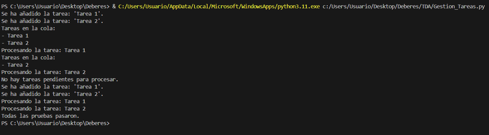

# Sistema de gestión de tareas.

## Descripción del Proyecto

Este proyecto implementa un TDA (Tipo Abstracto de Datos) de cola utilizando la clase `deque` de Python y una aplicación simple de gestión de tareas (Task Manager) que permite añadir, procesar y mostrar tareas en una cola. La cola sigue el principio FIFO (First In, First Out), lo que significa que las tareas se procesan en el orden en que se añaden.

### Clases Principales

1. **Queue**: Implementa la estructura de datos de cola con operaciones básicas como `enqueue` (añadir elemento), `dequeue` (quitar y retornar el primer elemento), `is_empty` (verificar si la cola está vacía) y `size` (obtener el tamaño de la cola).

2. **TaskManager**: Utiliza la clase `Queue` para gestionar una cola de tareas. Permite añadir tareas a la cola, procesarlas (quitarlas de la cola) y mostrar todas las tareas actuales en la cola.

## Instrucciones para Compilar y Ejecutar la Aplicación
1. **Requisitos Previos**: Asegúrate de tener Python instalado en tu sistema. Puedes descargar Python desde [python.org](https://www.python.org/downloads/).

2. **Clonar el Repositorio**:
    ```sh
    git clone https://github.com/tu_usuario/TDA.git
    cd TDA
    ```

3. **Ejecutar la Aplicación**:
    ```sh
    python Gestion_Tareas.py
    ```


## Ejemplos de Uso

Al ejecutar el archivo `Gestion_Tareas.py`, la aplicación demostrará el uso del Task Manager con los siguientes pasos:

1. Añadir tareas a la cola.
2. Mostrar las tareas en la cola.
3. Procesar una tarea (quitarla de la cola).
4. Mostrar nuevamente las tareas en la cola.
5. Procesar las tareas restantes.


